# SERA ワークフロー: Phase 0 -- Phase 8

本文書では SERA の全 8 フェーズ（Phase 0 から Phase 8）の詳細なワークフローを解説する。各フェーズの入出力、内部処理、遷移条件を実装に基づいて正確に記述する。

## パイプライン全体図

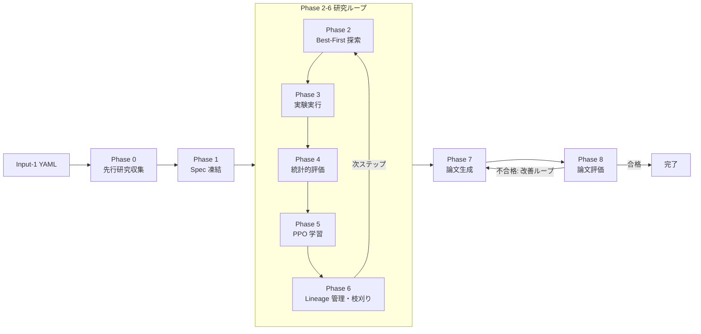

### フェーズ間データフロー

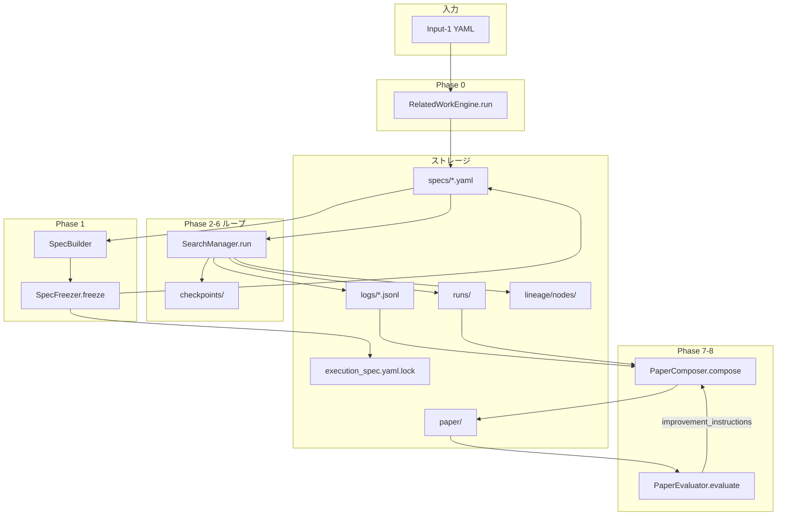

---

## Phase 0: 先行研究収集

**CLI**: `sera phase0-related-work`

**エントリポイント**: `RelatedWorkEngine.run(input1, config)`

### 処理フロー

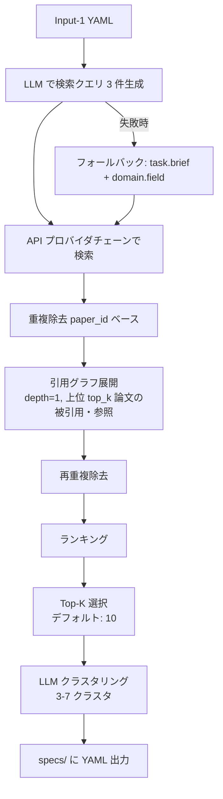

### API プロバイダの優先順位

検索は以下の順序で試行され、結果を返した最初のプロバイダが使われる。

1. **Semantic Scholar** (`SEMANTIC_SCHOLAR_API_KEY` で認証)
2. **CrossRef** (`CROSSREF_EMAIL` でポライトプール)
3. **arXiv** (認証不要)
4. **Web 検索** (`SERPAPI_API_KEY` による SerpAPI フォールバック)

### ランキング計算式

```
combined_score = citation_weight * citation_norm + (1 - citation_weight) * relevance_score
```

- `citation_norm = log(1 + citations) / log(1 + max_citations)`
- `citation_weight`: デフォルト `0.6`
- `relevance_score`: 各論文に付与されるスコア（デフォルト `0.5`）

### クラスタリング

- LLM にランキング済み論文リストを提示し、テーマ別クラスタの JSON 配列を生成させる
- JSON パース失敗時のフォールバック: 全論文を 1 つのクラスタにまとめる

### 出力

| ファイル | 内容 |
|---------|------|
| `specs/related_work_spec.yaml` | 論文メタデータ・クラスタ・スコア |
| `specs/paper_score_spec.yaml` | 各論文の引用正規化値・関連度・総合スコア |
| `specs/teacher_paper_set.yaml` | 上位論文（デフォルト 5 件）のスタイル参照用セット |

### 設定パラメータ

| パラメータ | CLI オプション | デフォルト | 説明 |
|-----------|---------------|----------|------|
| `top_k_papers` | `--topk` | 10 | 最終選択論文数 |
| `teacher_papers` | `--teacher-papers` | 5 | 教師論文数 |
| `citation_graph_depth` | `--citation-depth` | 1 | 引用グラフ展開の深さ |
| `recent_years_bias` | `--years-bias` | 5 | 最近 N 年の論文を優先 |
| `api_priority` | `--api-priority` | `semantic_scholar,crossref,arxiv,web` | プロバイダ優先順位 |

---

## Phase 1: Spec 凍結

**CLI**: `sera freeze-specs`

**エントリポイント**: `SpecBuilder` (LLM で ProblemSpec/PlanSpec を生成) -> `SpecFreezer.freeze()` (全 Spec を保存・ロック)

### 処理フロー

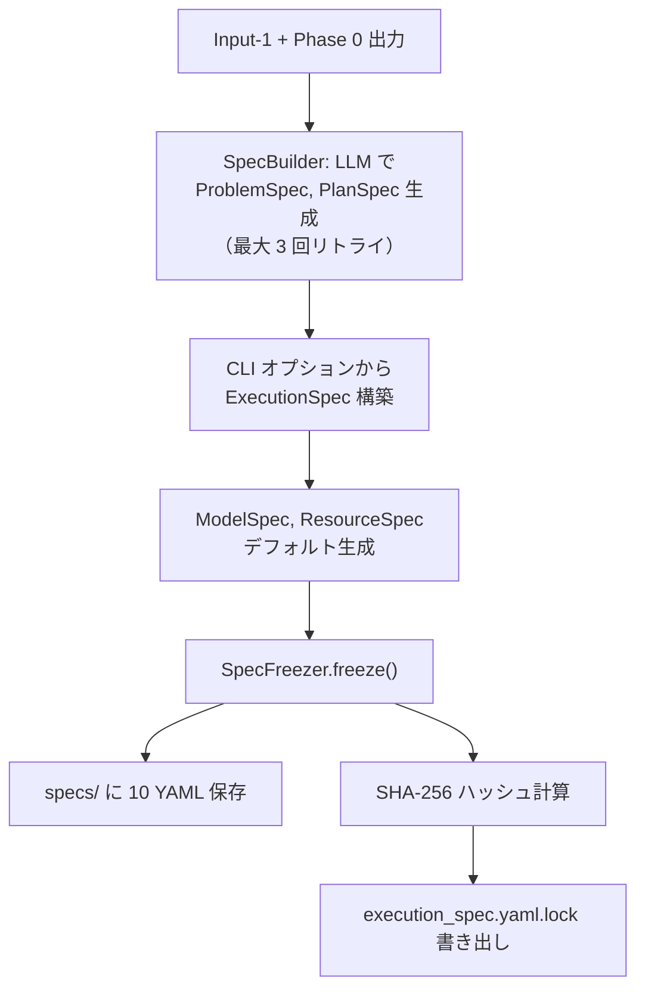

### 凍結される Spec ファイル一覧

| ファイル名 | Spec クラス | 説明 |
|-----------|-----------|------|
| `input1.yaml` | `Input1Model` | Input-1 のコピー |
| `related_work_spec.yaml` | `RelatedWorkSpec` | 先行研究（Phase 0 出力） |
| `paper_spec.yaml` | `PaperSpecModel` | 論文構成設定 |
| `paper_score_spec.yaml` | `PaperScoreSpecModel` | 論文評価基準 |
| `teacher_paper_set.yaml` | `TeacherPaperSetModel` | 教師論文セット |
| `problem_spec.yaml` | `ProblemSpecModel` | 問題仕様（LLM 生成） |
| `model_spec.yaml` | `ModelSpecModel` | モデル設定 |
| `resource_spec.yaml` | `ResourceSpecModel` | リソース設定 |
| `plan_spec.yaml` | `PlanSpecModel` | 探索計画（LLM 生成） |
| `execution_spec.yaml` | `ExecutionSpecModel` | 実行ハイパーパラメータ（凍結レイヤ） |
| `execution_spec.yaml.lock` | -- | SHA-256 ハッシュ（改竄検知用） |

### 改竄検知

- `SpecFreezer.verify()` は `execution_spec.yaml` の SHA-256 ハッシュを `execution_spec.yaml.lock` と比較する
- 不一致時: `sera research` は **exit code 2** で異常終了する
- 対処法: `sera freeze-specs` を再実行して Spec を再生成する

### デフォルトのベースモデル

```
Qwen/Qwen2.5-Coder-7B-Instruct
```

ModelSpec の `adapter_spec` には追加でアダプタの revision と `adapter_spec_hash` が自動計算される（transformers の `AutoConfig` による commit hash 取得）。

---

## Phase 2: Best-First 木探索

**CLI**: `sera research` (Phase 2-6 ループ内)

**エントリポイント**: `SearchManager.run()`

### 処理フロー

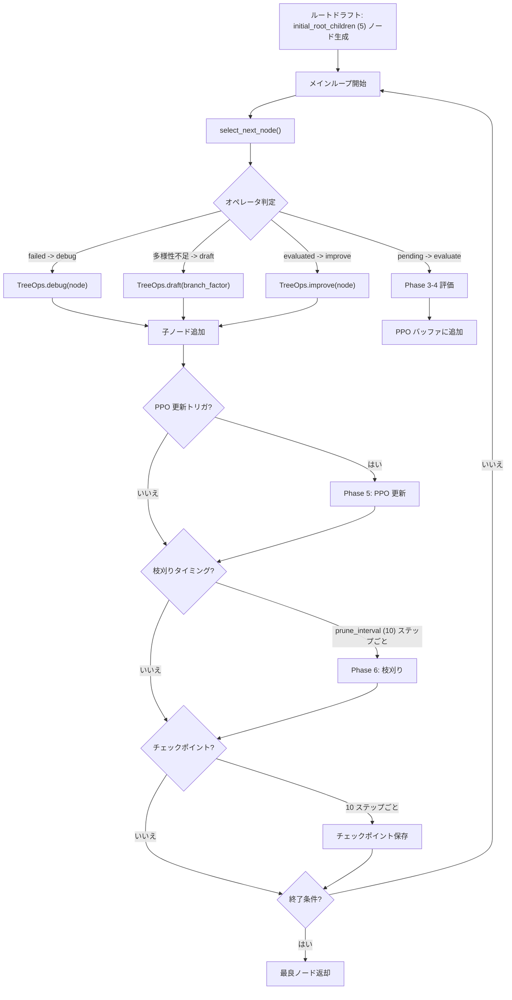

### ルートドラフトのカテゴリ分割

`initial_root_children` (デフォルト 5) ノードは 3 カテゴリに分割される:

| カテゴリ | 件数 | 説明 |
|---------|------|------|
| `baseline` | n // 3 | 既知の従来手法によるベースライン |
| `open_problem` | n // 3 | 既知の未解決問題への取り組み |
| `novel` | n // 3 + 余り | 独創的・非従来型のアプローチ |

Phase 0 の `related_work` からベースライン候補や未解決問題の情報がプロンプトに注入される。

### オペレータ自動選択ロジック (`select_next_node`)

優先順位:

1. **debug**: `status == "failed"` かつ `debug_depth < max_debug_depth (3)` のノード
2. **draft (多様性)**: 評価済みノード >= `draft_trigger_after (10)` かつユニークメソッド数 < `min_diverse_methods (3)` の場合、新規ドラフト生成
3. **evaluate**: 優先度キューから `status == "pending"` のノードをポップ
4. **improve**: 優先度キューから `status == "evaluated"` のノードをポップ

### 優先度計算

```
priority = lcb - lambda_cost * total_cost + beta_exploration * (1 / sqrt(eval_runs + 1))
```

| 条件 | 優先度 |
|------|--------|
| 実行不可能 (`feasible == False`) | `-inf` |
| 未評価 (`lcb is None`) | `+inf` |
| 通常 | 上記の式 |

パラメータ:
- `lambda_cost`: デフォルト `0.1`
- `beta_exploration`: デフォルト `0.05`

### ヒープキューの実装

- Python の `heapq`（最小ヒープ）を使用
- 優先度を**符号反転**して格納: `heappush(open_list, (-priority, node_id))`
- ポップ時に最大優先度のノードが取得される

### 終了条件

探索ループは以下のいずれかの条件で終了する:

| 条件 | デフォルト値 | 説明 |
|------|------------|------|
| `max_nodes` 到達 | 100 | 探索木のノード総数が上限に達した |
| `max_steps` 到達 | `max_nodes` と同値 | ステップ数が上限に達した |
| 処理可能ノードなし | -- | pending, debuggable, expandable なノードがすべてなくなった |
| `stop_on_plateau` | `False`（無効） | `plateau_patience (10)` ステップ改善なしで停止 |

### SIGINT ハンドリング

- SIGINT 受信時: チェックポイント保存後 `sys.exit(20)`
- `sera research --resume` で最新チェックポイントから再開可能

---

## Phase 3: 実験実行

**エントリポイント**: `ExperimentGenerator.generate()` -> `LocalExecutor.run()` (または `SlurmExecutor` / `DockerExecutor`)

### 処理フロー

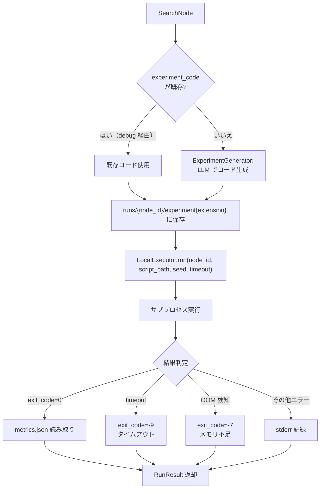

### 多言語サポート

`ProblemSpec.language` の `LanguageConfig` により、実験スクリプトの言語を設定できる:

| 設定項目 | デフォルト | 説明 |
|---------|----------|------|
| `name` | `"python"` | プログラミング言語名 |
| `interpreter_command` | `"python"` | インタープリタコマンド |
| `file_extension` | `".py"` | スクリプトのファイル拡張子 |
| `seed_arg_format` | `"--seed {seed}"` | シード引数のフォーマット |
| `code_block_tag` | `"python"` | Markdown コードブロックのタグ |

### 実験スクリプトの出力仕様

スクリプトは `metrics.json` をカレントディレクトリに出力する必要がある:

```json
{
  "primary": {"name": "<metric_name>", "value": 0.95, "higher_is_better": true},
  "constraints": [...],
  "secondary": [...],
  "raw": {},
  "seed": 42,
  "wall_time_sec": 12.5,
  "<metric_name>": 0.95
}
```

### 終了コード

| コード | 意味 |
|-------|------|
| `0` | 正常終了 |
| `-9` | タイムアウト（プロセス kill） |
| `-7` | OOM 検知 |
| `137` | SIGKILL（Linux OOM Killer 等） |
| `126` | OSError |
| `127` | FileNotFoundError（スクリプト/インタープリタ未発見） |

---

## Phase 4: 統計的評価

**エントリポイント**: `StatisticalEvaluator.evaluate_initial()` -> `StatisticalEvaluator.evaluate_full()`

### 処理フロー

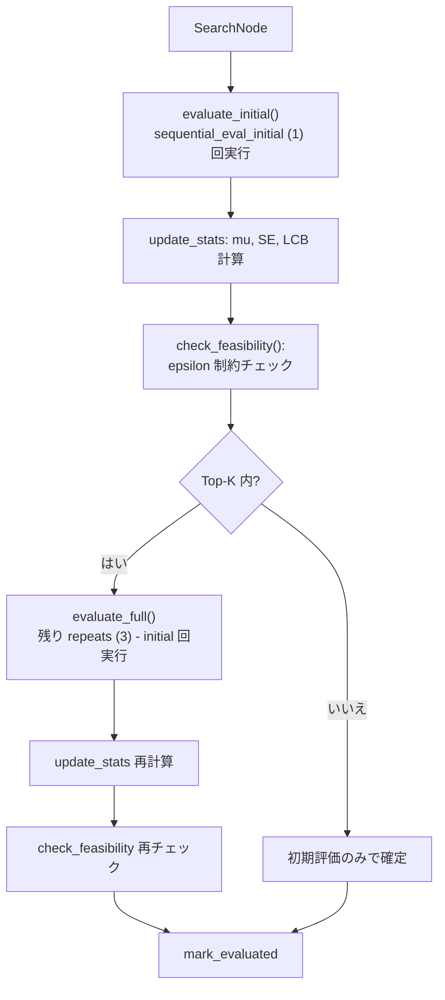

### 2 段階逐次評価

1. **`evaluate_initial()`**: `sequential_eval_initial` (デフォルト 1) 回のみ実行し、高速な初期推定を行う
2. **`evaluate_full()`**: Top-K (デフォルト 5) に入るノードに対して、残りの繰り返しを実行（合計 `repeats` (デフォルト 3) 回まで）

### 統計量の計算 (`update_stats`)

```
mu  = mean(values)
SE  = sqrt(variance / n)     （n >= 2 の場合）
LCB = mu - lcb_coef * SE     （lcb_coef デフォルト: 1.96）
```

特殊ケース:
- `n == 1`: `SE = inf`, `LCB = -inf`
- メトリクスなし: `mu = None`, `SE = None`, `LCB = None`

### シード導出

```python
seed = int(SHA256(f"{base_seed}:{node_id}:{repeat_idx}").hexdigest(), 16) % (2**31)
```

決定論的にシードが導出されるため、同じ `(base_seed, node_id, repeat_idx)` の組み合わせは常に同じシードを生成する。

### 実行可能性チェック (`check_feasibility`)

`ProblemSpec.constraints` の各制約に対して epsilon 許容範囲付きで検証:

| 制約型 | 条件 |
|--------|------|
| `bool` | `value` が truthy |
| `ge` | `value >= threshold - epsilon` |
| `le` | `value <= threshold + epsilon` |

全繰り返しの全メトリクスが制約を満たす場合のみ `feasible = True`。

---

## Phase 5: PPO 学習（オプション）

**エントリポイント**: `PPOTrainer.update()`

### 有効化条件

PPO 学習は以下の**両方**を満たす場合にのみ有効:

1. `ExecutionSpec.learning.enabled == True`
2. `AgentLLM.provider == "local"` (ローカル GPU モデル使用時)

### 報酬手法の選択

`plan_spec.reward.method` により報酬計算と Advantage 推定の手法を選択する:

| 手法 | 報酬計算 | Advantage 推定 | 必要な追加設定 |
|------|---------|---------------|--------------|
| `outcome_rm`（デフォルト） | `primary_value - penalties` | 従来の GAE | なし |
| `mt_grpo` | `Σ(weight * turn_reward) - penalties` | 従来の GAE（ターン報酬反映済み） | `turn_rewards` 設定 |
| `hiper` | `mt_grpo` と同一 | 3 層階層的 Advantage 分解 | `turn_rewards` + `hiper` 設定 |

### ターンレベル報酬（MT-GRPO / HiPER）

`turn_reward_evaluator` が有効な場合、Phase 4 の評価完了後に以下の Phase 毎報酬が計算される:

| Phase | 評価器 | 説明 |
|-------|--------|------|
| phase0 | `citation_relevance` | 仮説中の先行研究参照 |
| phase2 | `hypothesis_novelty` | 既存ノードとの新規性 |
| phase3 | `code_executability` | コード実行成功の二値 |
| phase4 | `metric_improvement` | 親ノード比の改善率 |
| phase7 | `paper_score_delta` | 論文スコア改善（プレースホルダ） |

### ECHO 軽量版（失敗知識注入）

`echo.enabled=True` の場合、debug オペレータ実行後に:

1. `FailureKnowledgeExtractor.extract(failed_node)` で失敗知識を構造化抽出
2. エラーカテゴリ分類: `runtime`, `oom`, `timeout`, `logical`, `unknown`
3. `inject(summary, siblings)` で兄弟ノードの `failure_context` に注入
4. improve プロンプトの `{failure_context}` プレースホルダに注入され、LLM が失敗パターンを回避

### トリガ条件

```python
def should_update(n_evaluated):
    if n_evaluated < 2:
        return False
    if n_evaluated % ppo_trigger_interval == 0:  # デフォルト: 5
        return True
    if steps_since_improvement >= plateau_patience:  # プラトー検知
        return True
    return False
```

### 処理フロー

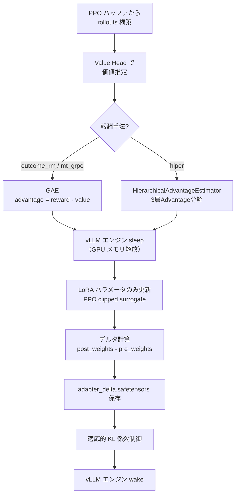

### HiPER 3 層 Advantage 分解

`method == "hiper"` の場合、`HierarchicalAdvantageEstimator` が以下の 3 層で Advantage を計算:

| 層 | 計算 | 重み（デフォルト） | 意味 |
|----|------|------------------|------|
| High Level | `reward - value` | 0.4 | 全体パフォーマンス |
| Switch Level | `-variance(turn_rewards)` | 0.3 | Phase 間バランスペナルティ |
| Low Level | `mean(turn_rewards) - value` | 0.3 | Phase 平均ベースの推定 |

最終 Advantage: `A = Σ(weight_i * A_i)`

### PPO 更新の詳細

| 項目 | 実装 |
|------|------|
| 損失関数 | `policy_loss + value_loss_coef * value_loss - entropy_coef * entropy` |
| Policy Loss | PPO clipped surrogate: `min(ratio * adv, clip(ratio, 1-clip_range, 1+clip_range) * adv)` |
| Value Loss | MSE: `0.5 * (values - returns)^2` |
| エントロピー | `trl.trainer.utils.entropy_from_logits` |
| 勾配クリッピング | `accelerate.Accelerator.clip_grad_norm_` |
| オプティマイザ | AdamW |
| アドバンテージ正規化 | バッチ内で標準化 |

### 適応的 KL 制御

```python
if mean_kl > kl_target * 1.5:
    kl_coef *= 2.0
elif mean_kl < kl_target / 1.5:
    kl_coef /= 2.0
```

### vLLM エンジンのスリープ/ウェイク

PPO 学習中は vLLM 推論エンジンをスリープさせて GPU メモリを解放する。学習完了後（成功・失敗に関わらず）ウェイクする。

### ライブラリ依存

| ライブラリ | 用途 |
|-----------|------|
| `trl.trainer.utils.entropy_from_logits` | エントロピー計算 |
| `trl.trainer.utils.selective_log_softmax` | 対数確率計算 |
| `accelerate.Accelerator` | デバイス管理・勾配操作 |
| `peft.get_peft_model_state_dict` | アダプタ重み抽出 |
| `peft.set_peft_model_state_dict` | アダプタ重み注入 |

---

## Phase 6: Lineage 管理と枝刈り

**エントリポイント**: `LineageManager.maybe_squash()` + `Pruner.prune()`

### Lineage 管理

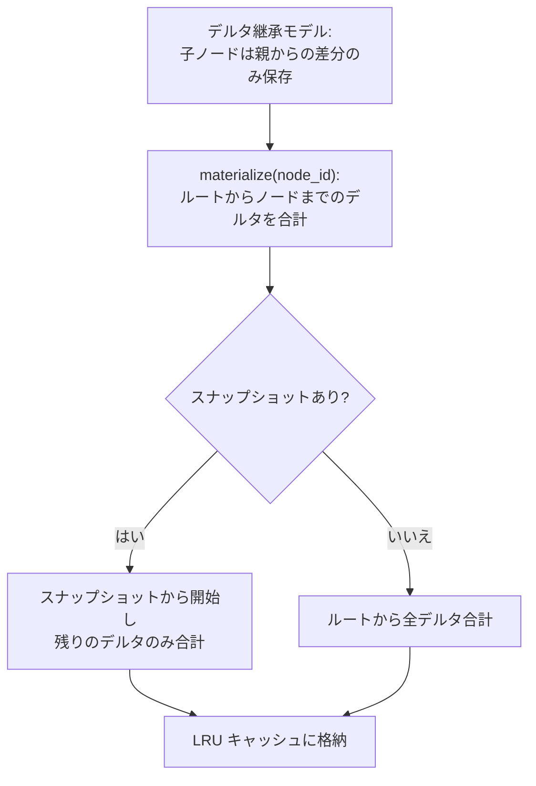

#### スクワッシュ (スナップショット作成)

```python
maybe_squash(exec_spec):
    squash_threshold = search.squash_depth or max_depth // 2
    for each node with depth >= squash_threshold:
        if not already snapshot:
            create_snapshot(node)  # materialize -> save adapter_snapshot.safetensors
```

- スクワッシュ閾値: `squash_depth`（デフォルト: `max_depth // 2`）
- スナップショットファイル: `lineage/nodes/<adapter_node_id>/adapter_snapshot.safetensors`
- メタデータ: `lineage/nodes/<adapter_node_id>/meta.json` の `is_snapshot` を `True` に更新

#### ディレクトリレイアウト

```
lineage/nodes/<adapter_node_id>/
  meta.json                    # ノードメタデータ (parent_id, depth, adapter_spec_hash 等)
  adapter_delta.safetensors    # 親からのデルタ
  adapter_snapshot.safetensors # 完全な重み (スクワッシュ後のみ)
```

### 枝刈り

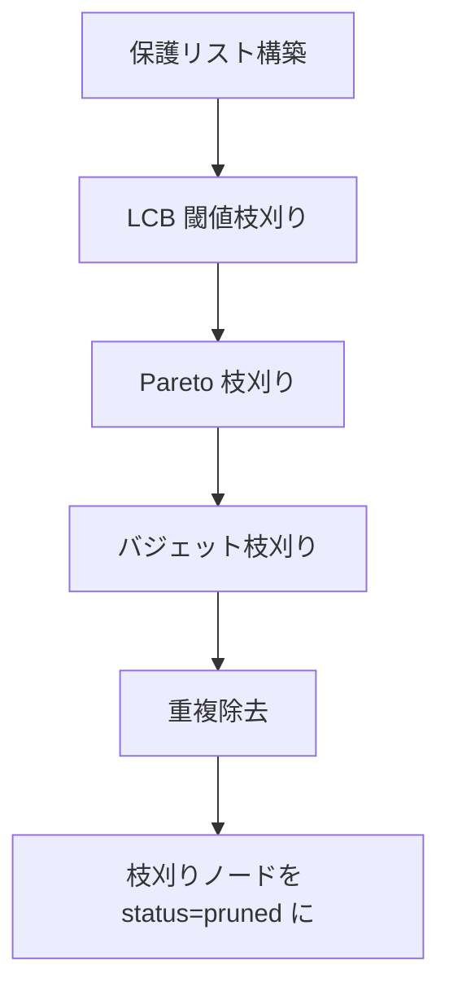

#### 保護リスト

以下のノードは枝刈りされない:

- **最良ノード** (最高 LCB) とその全祖先
- **Top-K ノード** (`keep_topk` デフォルト 5) とその全祖先
- **実行中ノード** (`status == "running"`)

#### 枝刈り戦略

| 戦略 | 動作 |
|------|------|
| **LCB 閾値** | `reward_threshold != 0` なら直接使用。それ以外は自動閾値 `best_lcb * 0.5` |
| **Pareto** | (LCB, cost) 空間で支配されるノードを除去。ノード A が B を支配する条件: A の LCB >= B の LCB かつ A のコスト <= B のコスト（少なくとも一方が厳密不等号）|
| **バジェット** | 総コストが `max_wall_time_hours * 3600` を超えた場合、LCB 最悪のノードから順に除去 |

#### 枝刈り間隔

```
prune_interval: 10  # デフォルト: 10 ステップごと
```

---

## Phase 7: 論文生成

**CLI**: `sera generate-paper`

**エントリポイント**: `PaperComposer.compose()` -- 6 ステップパイプライン

### 処理フロー

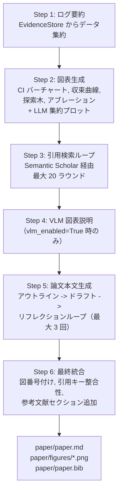

### 各ステップの詳細

**Step 1: ログ要約**
- `EvidenceStore` から実験サマリ、収束データ、アブレーションデータ、メイン結果テーブルを取得
- `experiment_summaries.json` として出力

**Step 2: 図表生成** (`FigureGenerator`)
- CI バーチャート: 全評価済みノードの信頼区間付きバーグラフ
- 収束曲線: ステップごとの最良 LCB の推移
- 探索木: ノード関係の可視化
- アブレーション: 変数ごとの効果分析
- LLM 集約プロット: `FigureGenerator.aggregate_plots()` による追加図表

**Step 3: 引用検索ループ** (`CitationSearcher`)
- Semantic Scholar API を使用
- 最大 `citation_search_rounds` (デフォルト 20) ラウンド
- 実験サマリのコンテキスト（先頭 5000 文字）をクエリに使用

**Step 4: VLM 図表説明** (`VLMReviewer`)
- `vlm_enabled=True` かつ VLM プロバイダが設定されている場合のみ
- 各図表に対して自然言語の説明を生成

**Step 5: 論文本文生成**
1. **アウトライン生成**: 実験結果・図表・引用を踏まえたセクション構成
2. **1パスドラフト**: アウトラインに基づく完全な初稿
3. **リフレクションループ**: 最大 `n_writeup_reflections` (デフォルト 3) 回
   - 未参照の図表、無効な引用キー、欠落セクションの自動検出
   - VLM フィードバック（有効時）の統合
   - 問題がなくなれば早期終了

**Step 6: 最終統合**
- 図の連番振り直し（Figure 1, Figure 2, ...）
- 引用キーの正規化
- References セクションの追加（未存在の場合）

### 出力ファイル

| ファイル | 内容 |
|---------|------|
| `paper/paper.md` | 論文本文（Markdown 形式） |
| `paper/figures/*.png` | 生成された図表 |
| `paper/paper.bib` | 参考文献（BibTeX 形式） |

---

## Phase 8: 論文評価・改善ループ

**CLI**: `sera evaluate-paper`

**エントリポイント**: `PaperEvaluator.evaluate()`

### 処理フロー

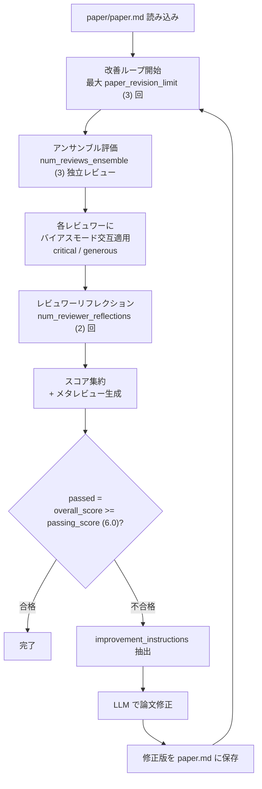

### アンサンブルレビュー

- **レビュワー数**: `num_reviews_ensemble` (デフォルト 3)
- **バイアスモード**: 交互に `critical` / `generous` を割り当て（偶数インデックス: critical、奇数: generous）
- **リフレクション回数**: 各レビュワーが `num_reviewer_reflections` (デフォルト 2) 回自己レビューを改善
- **温度**: `temperature` (デフォルト 0.75)

### レビュー形式

各レビュワーは以下のフィールドを含む構造化レビューを生成:

- `SUMMARY`: 1-2 文の要約
- `STRENGTHS`: 長所リスト
- `WEAKNESSES`: 短所リスト
- `QUESTIONS`: 質問リスト
- `LIMITATIONS`: 制限事項リスト
- `MISSING`: 欠落項目リスト
- `IMPROVEMENTS`: 改善提案リスト
- `SCORES`: 基準ごとのスコア
- `OVERALL`: 総合スコア (1-max_score)
- `CONFIDENCE`: 信頼度 (0.0-1.0)
- `DECISION`: `accept` / `revise` / `reject`

### スコア集約

- **基準別スコア**: 全レビュワーの平均
- **総合スコア**: 各レビュワーの `overall_score` の平均
- **信頼度**: 各レビュワーの `confidence` の平均
- **判定**: 多数決（`Counter.most_common`）
- **合否**: `overall_score >= passing_score` (デフォルト 6.0)

### メタレビュー

2 件以上のレビューがある場合、Area Chair スタイルのメタレビューを生成:

1. レビュー間の合意点と不一致点の整理
2. 最重要な長所・短所の強調
3. 最終推薦（accept / revise / reject）
4. 具体的な改善指示

### 改善ループ

- 最大 `paper_revision_limit` (デフォルト 3) 回のイテレーション
- 各イテレーション: 評価 -> 改善指示抽出 -> LLM による論文修正 -> 再評価
- `passed == True` で早期終了

---

## 研究ループの全体制御

`sera research` コマンドは Phase 2-6 を統合的に管理する `SearchManager` を介して実行される。

### ループ内の制御フロー

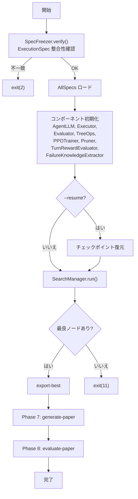

### チェックポイント

- **保存間隔**: 10 ステップごと
- **保存内容**: `step`, `all_nodes`, `closed_set`, `best_node_id`, `open_list`, `ppo_buffer`
- **SIGINT 時**: 自動保存後 `exit(20)`
- **復元**: `sera research --resume` で最新チェックポイントから再開

### エグゼキュータの選択

`ResourceSpec.compute.executor_type` に基づいて自動選択:

| 値 | エグゼキュータ | 説明 |
|----|--------------|------|
| `"local"` | `LocalExecutor` | ローカルサブプロセス実行（デフォルト） |
| `"slurm"` | `SlurmExecutor` | SLURM ジョブスケジューラ経由 |
| `"docker"` | `DockerExecutor` | Docker コンテナ内実行 |
